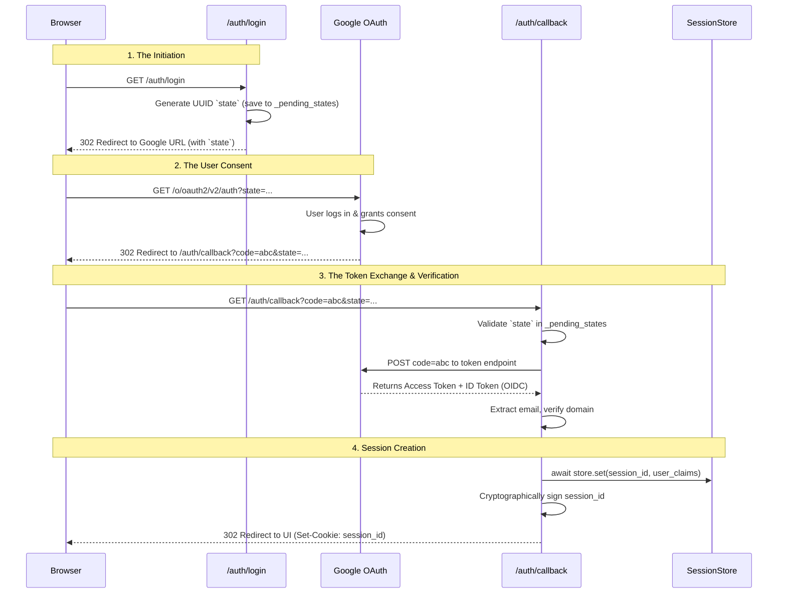
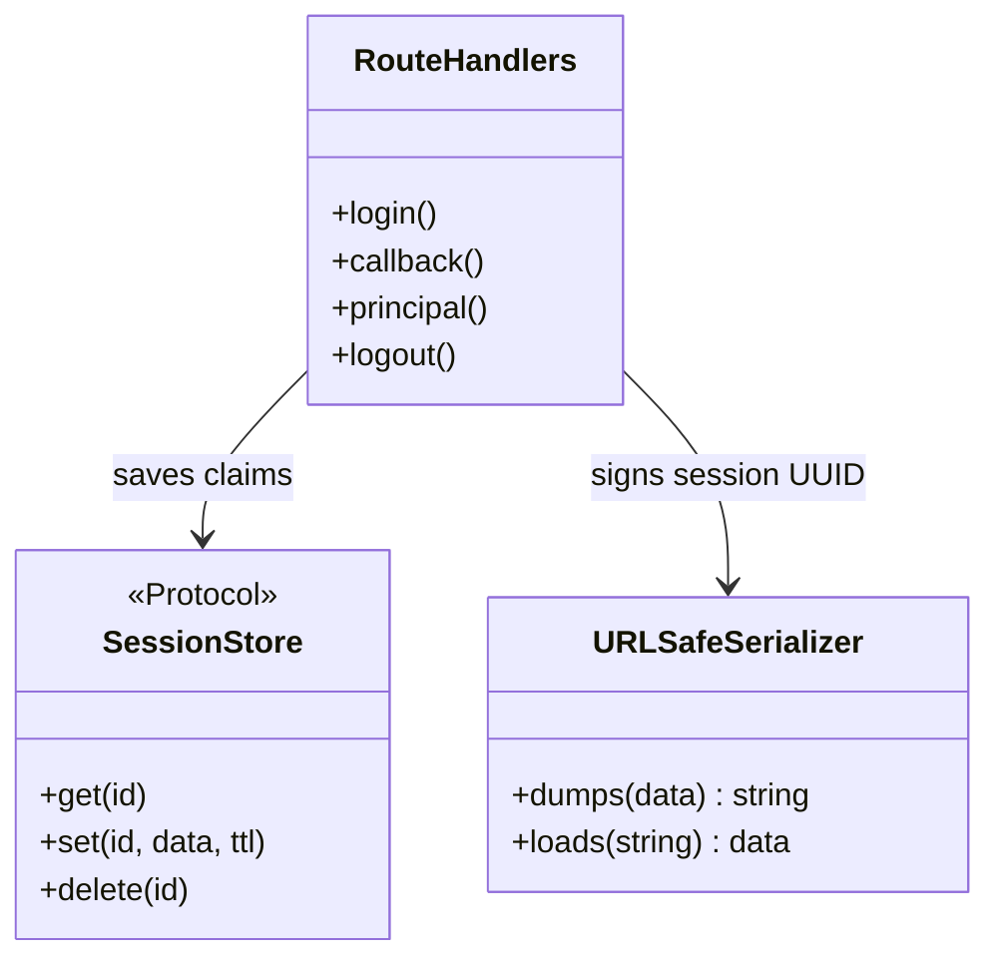

# Browser SSO: The OAuth Login Flow

Dockmaster acts as an Identity Provider wrapper around Google. It allows human users to log in via their Google accounts, verifies their domain, and issues a secure, stateful session cookie.

This guide explores the chronological journey of the login flow, breaking down the raw OAuth 2.0 and OIDC protocols, the strict security mitigations, and the session cryptography implemented in Dockmaster.

---

## The Chronological Flow

### Sequence Diagram: The Full Journey
Here is the exact sequence of HTTP redirects and state exchanges required to log a user in securely.



---

## Step 1: Initiation (`/auth/login`)

When a user wants to log in, they hit `/auth/login`. Dockmaster uses the `Authlib` library to handle the heavy lifting.

### Deep Dive: Authlib & OpenID Connect (OIDC)
OAuth 2.0 is an *authorization* protocol (granting access to APIs). It was never meant to be an *authentication* protocol (proving who the user is). 
To get user identity, Dockmaster uses **OpenID Connect (OIDC)**, an identity layer built on top of OAuth 2.0.

In `src/dockmaster/auth/oauth.py`, we configure Authlib using the OpenID Discovery URL:
```python
server_metadata_url="https://accounts.google.com/.well-known/openid-configuration"
```
**Why this is magic:** Instead of hardcoding Google's authorization, token, and JWKS endpoints, Authlib fetches this URL once on startup and automatically configures all the routing paths.

### Security Deep Dive: CSRF and the `state` Parameter
When Dockmaster redirects the user to Google, it attaches a random `state` string to the URL.

```python
state = str(uuid.uuid4())
_pending_states[state] = True
```
**The Threat (Cross-Site Request Forgery):** If an attacker logs into *their own* account, intercepts the Google callback URL (containing the `code`), and tricks a victim into clicking that URL, the victim's browser would send the code to Dockmaster. Dockmaster would log the victim into the *attacker's* account (allowing the attacker to see data the victim inputs).

**The Mitigation:** By generating a `state` UUID and keeping it in memory (`_pending_states`), Dockmaster ensures that the browser that *started* the login is the exact same browser that *finished* it.

*(Architectural Note: Currently `_pending_states` is an in-memory dictionary. If Dockmaster scales horizontally to multiple workers via Gunicorn, this state store would need to be moved to Redis, or stored in an encrypted pre-login cookie, to prevent State Mismatch errors when Worker A initiates but Worker B receives the callback.)*

---

## Step 2 & 3: The Callback (`/auth/callback`)

When Google redirects back to Dockmaster, it provides an Authorization `code`.

### The Prerequisite: `SessionMiddleware`
To perform the code-to-token exchange, `Authlib` requires Starlette's `SessionMiddleware`. Why? Because the OAuth 2.0 spec uses a mechanism called PKCE (Proof Key for Code Exchange) to prevent authorization code interception. The code verifier is temporarily stored in the Starlette session by Authlib before the redirect, and retrieved during the callback.

### The ID Token & Domain Logic
Once the code is exchanged, Google returns an **ID Token** (a JWT containing the user's profile claims).

```python
id_token_claims = token_response.get("userinfo", {})
email = id_token_claims.get("email")

# The Domain Verification
domain = email.partition("@")[2]
if domain not in settings.authorized_domains:
    raise HTTPException(status_code=403, detail=f"Domain not allowed: {domain}")
```

**Pythonic Safety (`partition`):** 
Why `email.partition("@")[2]` instead of `email.split("@")[1]`? 
If `email` somehow doesn't contain an `@` symbol, `split` will throw an `IndexError`, resulting in an unhandled 500 Server Error. `partition` safely returns an empty string for the domain, triggering a clean 403 Forbidden failure flow.

---

## Step 4: Session Creation & Cryptography

Once validated, Dockmaster creates a Session UUID, saves the user claims to the `SessionStore`, and issues a Cookie to the browser.

### Class Diagram: Session Management


### Deep Dive: Signed vs Encrypted Cookies
Dockmaster uses `itsdangerous.URLSafeSerializer` to sign the session UUID before sending it to the browser.

**Why Signed, not Encrypted?**
- **Encrypted Cookies** hide the data from the user. But our data is just a random UUID (e.g., `123e4567-e89b-12d3-a456-426614174000`). It is meaningless to the user anyway.
- **Signed Cookies** append a cryptographic hash (using `settings.session_secret_key`) to the data. 
- **The Result:** The cookie looks like `123e4567-e89b... . XYZ123Hash`. If a user tampers with the UUID, the hash will no longer match. When `signer.loads(cookie)` is called on the next request, it raises a `BadSignature` exception.

### Security Deep Dive: XSS & Cookie Flags
When issuing the cookie, Dockmaster applies strict flags to mitigate Cross-Site Scripting (XSS) attacks.

```python
response.set_cookie(
    key="session_id",
    value=signed_session_id,
    httponly=True,  # Prevents JavaScript (document.cookie) from reading the cookie (XSS mitigation)
    secure=True,    # Only sends the cookie over HTTPS
    samesite="lax", # Mitigates cross-site request forgery post-login
)
```

---

## Session Management (`/principal` and `/logout`)

Once the user has the cookie, the frontend UI needs to know *who* they are, and eventually log them out.

### The `/principal` Flow (Validation)
When the UI loads, it calls `/auth/principal`.
1. It reads the cookie.
2. It attempts `session_id = signer.loads(cookie)`.
3. **Graceful Degradation:** If the cookie is tampered with (raises `BadSignature`) or missing, it silently catches the error and returns `{}` (an empty JSON object). It does *not* throw a 500 error; an unauthenticated state is a valid, expected state.

### The `/logout` Flow (Destruction)
When the user clicks logout, the system must clean up both the client and the server.
1. It reads and validates the cookie signature.
2. If valid, it calls `await session_store.delete(session_id)`, erasing the stateful data from the backend.
3. It returns a 302 Redirect to the UI, while aggressively attaching a `response.delete_cookie(key="session_id", path="/")` header, commanding the browser to destroy the local token.