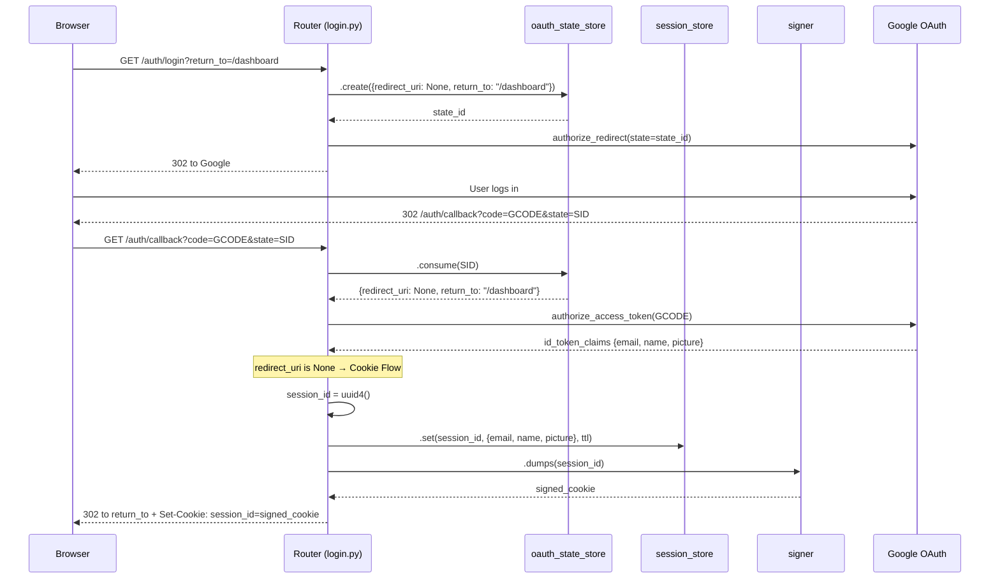
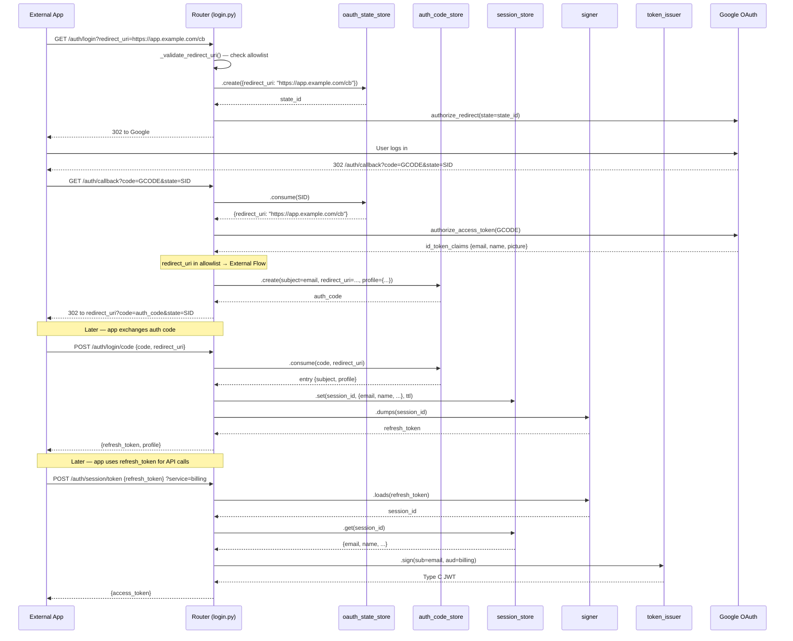

# OAuth Sequence Diagrams

Two flows exist depending on whether the client is same-domain (cookie) or cross-domain (refresh token).

---

## Flow 1: Cookie Flow (browser, same-domain)

Used when `GET /auth/login` is called **without** a `redirect_uri` param.
The browser gets a `session_id` cookie and is redirected to `return_to` (or `/ui/`).

### Participants

| Participant | Description |
|---|---|
| **Browser** | End-user's browser |
| **Router** | `routes/login.py` — handles `/auth/login`, `/auth/callback`, `/auth/logout` |
| **oauth_state_store** | `TTLStore[dict]` on `app.state` — CSRF state for OAuth round-trip |
| **session_store** | `SessionStore` on `app.state` — server-side sessions keyed by UUID |
| **signer** | `URLSafeSerializer(session_secret_key)` — signs/unsigns session IDs |
| **Google** | Google OAuth2 authorization + token endpoints |

### Sequence (inline)

```
Browser              Router (login.py)        oauth_state_store     session_store        signer            Google
  │                        │                        │                    │                  │                 │
  │  GET /auth/login       │                        │                    │                  │                 │
  │  ?return_to=/dashboard │                        │                    │                  │                 │
  ├───────────────────────►│                        │                    │                  │                 │
  │                        │  .create({             │                    │                  │                 │
  │                        │    redirect_uri: None,  │                    │                  │                 │
  │                        │    return_to: "/dashboard"})                 │                  │                 │
  │                        ├───────────────────────►│                    │                  │                 │
  │                        │◄─── state_id ──────────┤                    │                  │                 │
  │                        │                        │                    │                  │                 │
  │                        │  oauth.google.authorize_redirect(state=state_id)               │                 │
  │                        ├──────────────────────────────────────────────────────────────────────────────────►│
  │◄─── 302 to Google ────┤                        │                    │                  │                 │
  │                        │                        │                    │                  │                 │
  │  (user logs in at Google)                       │                    │                  │                 │
  ├──────────────────────────────────────────────────────────────────────────────────────────────────────────►│
  │                        │                        │                    │                  │                 │
  │◄─── 302 /auth/callback?code=GCODE&state=SID ───────────────────────────────────────────────────────────┤
  │                        │                        │                    │                  │                 │
  │  GET /auth/callback    │                        │                    │                  │                 │
  │  ?code=GCODE&state=SID │                        │                    │                  │                 │
  ├───────────────────────►│                        │                    │                  │                 │
  │                        │  .consume(SID)         │                    │                  │                 │
  │                        ├───────────────────────►│                    │                  │                 │
  │                        │◄─ {redirect_uri: None, │                    │                  │                 │
  │                        │    return_to: "/dashboard"}                  │                  │                 │
  │                        │                        │                    │                  │                 │
  │                        │  authorize_access_token(GCODE)              │                  │                 │
  │                        ├──────────────────────────────────────────────────────────────────────────────────►│
  │                        │◄─ id_token_claims {email, name, picture} ──────────────────────────────────────┤
  │                        │                        │                    │                  │                 │
  │                        │  redirect_uri is None → COOKIE FLOW         │                  │                 │
  │                        │                        │                    │                  │                 │
  │                        │  session_id = uuid4()  │                    │                  │                 │
  │                        │  session_data = {email, name, picture}      │                  │                 │
  │                        │                        │                    │                  │                 │
  │                        │  .set(session_id, session_data, ttl)        │                  │                 │
  │                        ├────────────────────────────────────────────►│                  │                 │
  │                        │                        │                    │                  │                 │
  │                        │  .dumps(session_id) → signed_cookie         │                  │                 │
  │                        ├───────────────────────────────────────────────────────────────►│                 │
  │                        │◄─ signed_cookie ───────────────────────────────────────────────┤                 │
  │                        │                        │                    │                  │                 │
  │◄─── 302 to return_to ─┤                        │                    │                  │                 │
  │     Set-Cookie:        │  (or /ui/ if no        │                    │                  │                 │
  │     session_id=signed  │   return_to)           │                    │                  │                 │
```

### Mermaid



---

## Flow 2: Refresh Token Flow (cross-domain app)

Used when `GET /auth/login` is called **with** a `redirect_uri` param (must be in allowlist).
The external app receives an auth code, exchanges it for a `refresh_token` + `profile`.

### Participants

| Participant | Description |
|---|---|
| **App** | External app on a different domain (e.g., `app.example.com`) |
| **Router** | `routes/login.py` — handles `/auth/login`, `/auth/callback`, `/auth/login/code` |
| **oauth_state_store** | `TTLStore[dict]` on `app.state` — CSRF state for OAuth round-trip |
| **auth_code_store** | `AuthCodeStore` on `app.state` — single-use auth codes with redirect_uri binding |
| **session_store** | `SessionStore` on `app.state` — server-side sessions keyed by UUID |
| **signer** | `URLSafeSerializer(session_secret_key)` — signs/unsigns session IDs |
| **token_issuer** | `EphemeralKeypairSigner` on `app.state` — signs Type C JWTs (used later for `/auth/session/token`) |
| **Google** | Google OAuth2 authorization + token endpoints |

### Sequence (inline)

```
App                  Router (login.py)        oauth_state_store     auth_code_store      session_store        signer            Google
  │                        │                        │                    │                    │                  │                 │
  │  GET /auth/login       │                        │                    │                    │                  │                 │
  │  ?redirect_uri=https://app.example.com/cb       │                    │                    │                  │                 │
  ├───────────────────────►│                        │                    │                    │                  │                 │
  │                        │  _validate_redirect_uri()                   │                    │                  │                 │
  │                        │  (checks allowlist)    │                    │                    │                  │                 │
  │                        │                        │                    │                    │                  │                 │
  │                        │  .create({             │                    │                    │                  │                 │
  │                        │    redirect_uri: "https://app.example.com/cb"})                  │                  │                 │
  │                        ├───────────────────────►│                    │                    │                  │                 │
  │                        │◄─── state_id ──────────┤                    │                    │                  │                 │
  │                        │                        │                    │                    │                  │                 │
  │                        │  authorize_redirect(state=state_id)         │                    │                  │                 │
  │◄─── 302 to Google ────┤                        │                    │                    │                  │                 │
  │                        │                        │                    │                    │                  │                 │
  │  (user logs in at Google)                       │                    │                    │                  │                 │
  │                        │                        │                    │                    │                  │                 │
  │◄─── 302 /auth/callback?code=GCODE&state=SID    │                    │                    │                  │                 │
  │                        │                        │                    │                    │                  │                 │
  │  GET /auth/callback    │                        │                    │                    │                  │                 │
  ├───────────────────────►│                        │                    │                    │                  │                 │
  │                        │  .consume(SID)         │                    │                    │                  │                 │
  │                        ├───────────────────────►│                    │                    │                  │                 │
  │                        │◄─ {redirect_uri: "https://app.example.com/cb"}                  │                  │                 │
  │                        │                        │                    │                    │                  │                 │
  │                        │  authorize_access_token(GCODE)              │                    │                  │                 │
  │                        ├──────────────────────────────────────────────────────────────────────────────────────────────────────►│
  │                        │◄─ id_token_claims {email, name, picture} ──────────────────────────────────────────────────────────┤
  │                        │                        │                    │                    │                  │                 │
  │                        │  redirect_uri in allowlist → EXTERNAL FLOW  │                    │                  │                 │
  │                        │                        │                    │                    │                  │                 │
  │                        │  .create(subject=email, │                   │                    │                  │                 │
  │                        │    redirect_uri=...,    │                   │                    │                  │                 │
  │                        │    profile={name, picture})                 │                    │                  │                 │
  │                        ├────────────────────────────────────────────►│                    │                  │                 │
  │                        │◄─── auth_code ─────────────────────────────┤                    │                  │                 │
  │                        │                        │                    │                    │                  │                 │
  │◄─── 302 to redirect_uri?code=auth_code&state=SID                    │                    │                  │                 │
  │                        │                        │                    │                    │                  │                 │
  │  ─ ─ ─ ─ ─ ─ ─ ─ ─ ─ (later, app exchanges code) ─ ─ ─ ─ ─ ─ ─ ─ │                    │                  │                 │
  │                        │                        │                    │                    │                  │                 │
  │  POST /auth/login/code │                        │                    │                    │                  │                 │
  │  {code, redirect_uri}  │                        │                    │                    │                  │                 │
  ├───────────────────────►│                        │                    │                    │                  │                 │
  │                        │  .consume(code, redirect_uri)               │                    │                  │                 │
  │                        ├────────────────────────────────────────────►│                    │                  │                 │
  │                        │◄─ entry {subject, profile} ────────────────┤                    │                  │                 │
  │                        │                        │                    │                    │                  │                 │
  │                        │  session_id = uuid4()  │                    │                    │                  │                 │
  │                        │  .set(session_id, {email, ...}, ttl)        │                    │                  │                 │
  │                        ├─────────────────────────────────────────────────────────────────►│                  │                 │
  │                        │                        │                    │                    │                  │                 │
  │                        │  .dumps(session_id) → refresh_token         │                    │                  │                 │
  │                        ├────────────────────────────────────────────────────────────────────────────────────►│                 │
  │                        │◄─ refresh_token ───────────────────────────────────────────────────────────────────┤                 │
  │                        │                        │                    │                    │                  │                 │
  │◄─── {refresh_token, profile} ──────────────────────────────────────────────────────────────────────────────│                 │
  │                        │                        │                    │                    │                  │                 │
  │  ─ ─ ─ ─ ─ ─ ─ ─ (later, app uses refresh_token for API calls) ─ ─ ─ ─ ─ ─ ─ ─ ─ ─ ─ │                  │                 │
  │                        │                        │                    │                    │                  │                 │
  │  POST /auth/session/token                       │                    │                    │                  │                 │
  │  {refresh_token}       │                        │                    │                    │                  │                 │
  │  ?service=billing      │                        │                    │                    │                  │                 │
  ├───────────────────────►│                        │                    │                    │                  │                 │
  │                        │  allow_session:         │                    │                    │                  │                 │
  │                        │  .loads(refresh_token) → session_id         │                    │                  │                 │
  │                        ├────────────────────────────────────────────────────────────────────────────────────►│                 │
  │                        │◄─ session_id ──────────────────────────────────────────────────────────────────────┤                 │
  │                        │  .get(session_id) → session_data            │                    │                  │                 │
  │                        ├─────────────────────────────────────────────────────────────────►│                  │                 │
  │                        │◄─ {email, name, ...} ──────────────────────────────────────────┤                  │                 │
  │                        │                        │                    │                    │                  │                 │
  │                        │  token_issuer.sign(sub=email, aud=billing)  │                    │                  │                 │
  │                        │                        │                    │                    │                  │                 │
  │◄─── {access_token (Type C JWT)} ───────────────────────────────────────────────────────────────────────────│                 │
```

### Mermaid



---

## Parameter Reference

| Parameter | Flow | Where set | Where consumed | Purpose |
|---|---|---|---|---|
| `redirect_uri` | Refresh token | `GET /auth/login?redirect_uri=X` | `oauth_state_store`, `auth_code_store`, `POST /auth/login/code` | Identifies the external app's callback URL. Must be in `allowed_redirect_uris`. Bound to the auth code — must match on consume. |
| `return_to` | Cookie | `GET /auth/login?return_to=X` | `oauth_state_store` → callback redirect | Where to send the browser after setting the session cookie. Defaults to `/ui/`. **Not yet implemented.** |
| `state` | Both | `oauth_state_store.create()` | `GET /auth/callback?state=X` → `oauth_state_store.consume()` | OAuth CSRF token. Carries `redirect_uri` and `return_to` through the Google round-trip. |
| `code` (Google) | Both | Google issues it | `GET /auth/callback?code=X` → `authorize_access_token()` | Google's authorization code, exchanged for tokens server-side. |
| `code` (auth) | Refresh token | `auth_code_store.create()` | `POST /auth/login/code` → `auth_code_store.consume()` | Dockmaster's single-use auth code, bridges callback → code exchange. |
| `refresh_token` | Refresh token | `signer.dumps(session_id)` | `POST /auth/session/token`, `POST /auth/logout` | Signed session ID for cross-domain clients. Equivalent to the `session_id` cookie but passed in request body. |
| `session_id` cookie | Cookie | `signer.dumps(session_id)` in callback | `allow_session`, `check_ui_session` (read from cookie jar) | Signed session ID for same-domain browser clients. Set as `httponly`, `secure`, `samesite=lax`. |

---

## Store Lifecycle Summary

| Store | Created | Consumed | TTL | Notes |
|---|---|---|---|---|
| `oauth_state_store` | `GET /auth/login` | `GET /auth/callback` | 600s | Single-use. Carries `redirect_uri` + `return_to`. |
| `auth_code_store` | `GET /auth/callback` (external flow) | `POST /auth/login/code` or `POST /auth/code/exchange` | 300s | Single-use. Redirect_uri must match on consume. Now carries `profile`. |
| `session_store` | `GET /auth/callback` (cookie flow) or `POST /auth/login/code` (refresh flow) | `allow_session`, `check_ui_session`, `get_session_user`, `POST /auth/logout` | `session_ttl` setting | Long-lived. Keyed by UUID. Resolved via signed cookie or signed refresh_token. |
