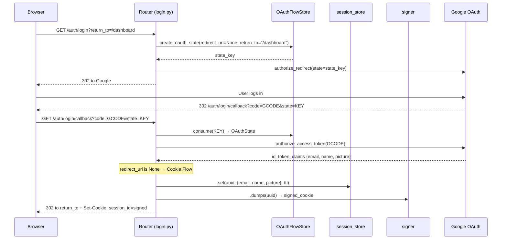
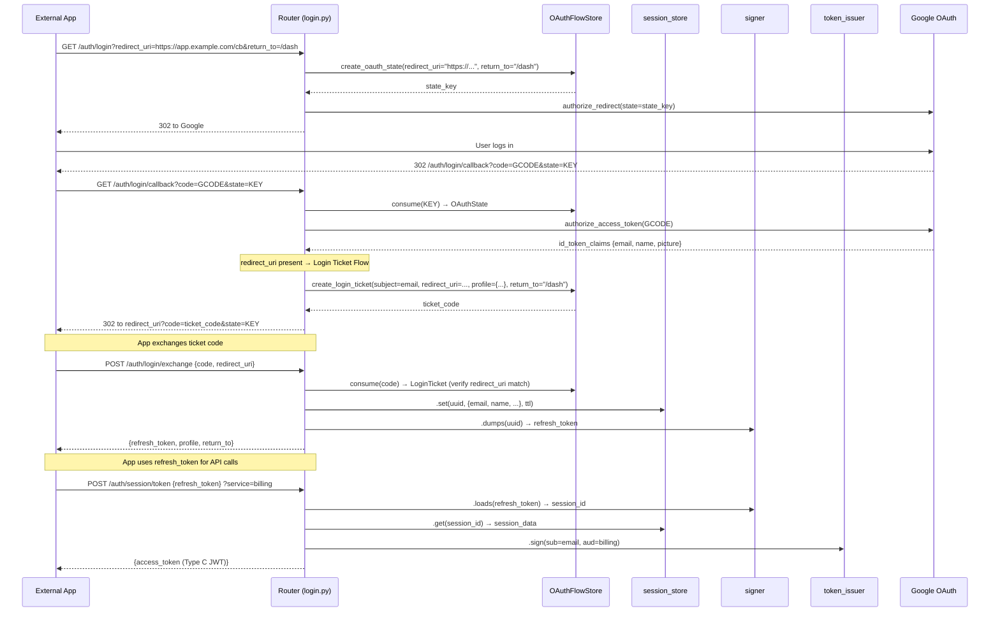
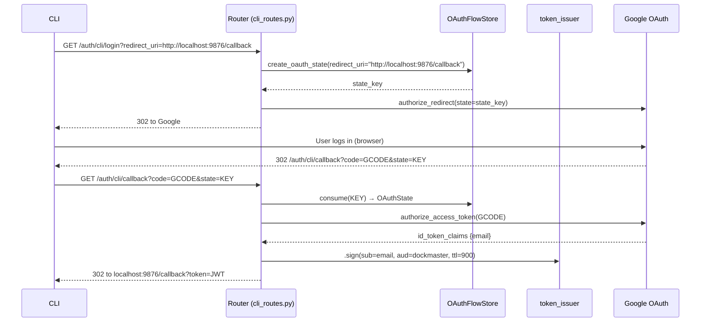

# Phase 11: Route Reorg + Refresh Token — Implementation Spec

> Clean route namespaces (login/session/service/cli), OAuthFlowStore consolidation,
> refresh token support for cross-domain browser clients, and `return_to` support.
> Python SDK split to Phase 12.

**Status**: In Progress (Steps 0-F complete, Steps G-H remain)
**Test count**: 474 passing (as of 2026-03-21)

---

## Problem

Dockmaster's routes grew incrementally across phases 4-8. The result:
- `login.py` handles cookie flow, refresh token flow, AND CLI flow in one callback
- `token.py` mixes session auth and JWT auth with a combined gate (`allow_jwt_or_session`)
- Two separate TTL stores (`oauth_state_store`, `auth_code_store`) serve the same login lifecycle
- Cross-domain browser clients have no way to maintain sessions (cookies don't cross TLDs)
- `principal` and `sessions` endpoints live in login.py despite being session-gated

## Solution

1. **Route reorganization** — split into login/session/service/cli namespaces
2. **OAuthFlowStore** — single store replacing `oauth_state_store` + `auth_code_store`
3. **Refresh token support** — signed session handles for cross-domain clients
4. **`return_to` support** — post-login redirect for both cookie and refresh token flows
5. **Logout content negotiation** — JSON for API clients, redirect for browsers

---

## Key Decisions

| Decision | Choice | Rationale |
|---|---|---|
| Cross-domain auth | Refresh tokens (signed session IDs) | Different TLDs can't share cookies |
| CLI OAuth | Own route pair (`/auth/cli/login`, `/auth/cli/callback`) | Removes branching from main callback |
| Store consolidation | `OAuthFlowStore` with `OAuthState` + `LoginTicket` models | Two internal TTLStores, one `consume()`, typed returns |
| Code exchange rename | `POST /auth/login/exchange` | Replaces both `/auth/code/exchange` (old) and `/auth/login/code` (v1) |
| Session lifetime | Refresh tokens die with session (SESSION_TTL, default 1h) | Simple. Session renewal deferred to backlog. |
| Logout | Content negotiation | JSON for refresh_token body, redirect for cookie |
| SDK | Separate Phase 12 | Independent scope, doesn't block route reorg |

---

## Auth Pattern Taxonomy

Dependencies follow a prefix convention:

```
HARD (raise on failure — route never executes)
├── allow_*      → auth enforcement (401/403)        [router-level]
│   ├── allow_jwt
│   ├── allow_session           (cookie OR refresh_token → 401)
│   ├── allow_google_credential
│   └── allow_jwt_admin
├── needs_*      → capability check (503)            [router or route-level]
│   ├── needs_session_store
│   └── needs_admin_storage

SOFT (never raise — route decides what to do)
├── check_*      → auth evaluation → AuthResult      [route-level]
│   └── check_ui_session(service?, permission?)
└── get_*        → data/info → value or empty        [route-level]
    ├── get_session_user     (cookie OR refresh_token → dict | {})
    ├── get_jwt_claims
    ├── get_google_claims
    ├── get_authority, get_session_store, get_admin_storage  (state bridges)
    └── get_ui_config, get_token_issuer                     (state bridges)
```

UI routes use `check_*` (soft auth) — no router-level gate. The route owns the full decision
tree because every branch produces HTML.

API routes use `allow_*` (hard auth) at the router level. Errors are JSON.

---

## Flow Diagrams

### Cookie Flow (same-domain browser)

`GET /auth/login` called **without** `redirect_uri`. Browser gets a `session_id` cookie.



### Refresh Token Flow (cross-domain app)

`GET /auth/login` called **with** `redirect_uri` (must be in allowlist).
External app receives a login ticket code, exchanges it for `{refresh_token, profile}`.



### CLI Flow

`GET /auth/cli/login` with localhost `redirect_uri`. Separate route pair, no login tickets.



---

## OAuthFlowStore Design

Replaces `oauth_state_store` (TTLStore[dict]) and `auth_code_store` (AuthCodeStore).

```python
class OAuthState(BaseModel):
    """CSRF state for an in-progress OAuth round-trip."""
    redirect_uri: str | None = None    # None = cookie flow, present = external/CLI
    return_to: str | None = None       # post-auth redirect target

class LoginTicket(BaseModel):
    """Pending login for an external app to claim via code exchange."""
    subject: str                       # authenticated email
    redirect_uri: str                  # must match on consume
    profile: dict = {}                 # OAuth profile claims
    return_to: str | None = None       # forwarded from OAuthState

class OAuthFlowStore:
    """Unified single-use store. Two internal TTLStores, one consume() method."""

    def __init__(self, oauth_state_ttl: int = 600, login_ticket_ttl: int = 300):
        self._oauth_states = TTLStore[OAuthState](ttl=oauth_state_ttl)
        self._login_tickets = TTLStore[LoginTicket](ttl=login_ticket_ttl)

    def create_oauth_state(...) -> str: ...
    def create_login_ticket(...) -> str: ...
    def consume(key: str) -> OAuthState | LoginTicket | None: ...
```

Callers use `isinstance()` to distinguish: callback expects `OAuthState`,
exchange expects `LoginTicket`.

---

## Current State (as of 2026-03-21)

### Completed

- **Step 0 — Foundations**: `AuthResult`, `check_ui_session`, state bridges
- **Step 0-pre**: `from __future__ import annotations` removed from all files
- **Step 1 — Auth gate cleanup**: `allow_session` → 401, UI routes → `check_ui_session`,
  `allow_session_admin` commented out, `ui.py` single router
- **Step A — CLI OAuth**: `cli_routes.py` with `/auth/cli/login`, `/auth/cli/callback`,
  `/auth/cli/token`. CLI branch removed from main callback.
- **Step B — OAuthFlowStore**: `auth/oauth_flow_store.py` with typed models
- **Step C — Wire OAuthFlowStore**: `app.state.flow_store` replaces old stores, `get_flow_store` bridge
- **Step D — Rename callback**: `GET /auth/login/callback`
- **Step E — return_to support**: cookie + refresh token flows, open redirect prevention
- **Step F — Rename exchange**: `POST /auth/login/exchange`
- **State bridge standardization**: all `request.app.state` access → `Depends(get_*)` bridges.
  Added `get_oauth`, `get_realm` to `state.py`. 8 bridges total.
- **Dependency taxonomy docs**: module docstrings + section dividers for the prefix convention
- **Legacy removal**: `/auth/principal` + `/auth/sessions` deleted (replaced by session.py)
- **keys.py**: `JSONResponse` errors → `HTTPException`, uses `get_realm` bridge

### Known edges (updated 2026-03-21)

| Edge | Status | Resolution |
|---|---|---|
| Logout returns redirect for API clients | Active | Step H content negotiation |
| `allow_jwt_or_session` dead code | Active | Step G delete |
| `PROFILE_CLAIM_KEYS` inconsistency (login.py includes email) | Active | Step G centralize |
| Double body parsing (allow_session + get_session_user) | Noted | Defer — FastAPI caches body |

---

## Implementation Steps

### Step 0-pre: Clean sweep `from __future__ import annotations`

Remove from all source files. Fix any `TYPE_CHECKING` guards to real imports.
Standalone commit.

### Step A: Extract CLI OAuth to `cli_routes.py`

1. Move `_LOCALHOST_RE`, `CLI_TOKEN_TTL` from login.py to cli_routes.py
2. Add `GET /auth/cli/login` — validate localhost redirect_uri, create OAuth state,
   redirect to Google with callback URI = `/auth/cli/callback`
3. Add `GET /auth/cli/callback` — consume state, exchange Google code, verify email/domain,
   mint 15-min JWT, redirect to localhost
4. Remove CLI branch from login.py callback
5. Move `allow_jwt` from router-level to route-level on `POST /auth/cli/token`
   (CLI OAuth routes must be public)
6. Update tests

**GCP note**: `/auth/cli/callback` needs to be an authorized redirect URI.

**Done when**: CLI flow isolated, login.py callback has no localhost branch, tests pass.

### Step B: Create `OAuthFlowStore` (pure addition)

1. Create `auth/oauth_flow_store.py` with `OAuthFlowStore`, `OAuthState`, `LoginTicket`
2. Create `tests/auth/test_oauth_flow_store.py` — create/consume round-trips, single-use,
   TTL expiry, type discrimination, redirect_uri matching
3. No existing code changed

**Done when**: New file + tests pass, no consumers wired yet.

### Step C: Wire `OAuthFlowStore` into app

1. Update `main.py` lifespan: `app.state.flow_store = OAuthFlowStore(...)`
   Remove `oauth_state_store` and `auth_code_store`
2. Update `login.py`: all `oauth_state_store`/`auth_code_store` refs → `flow_store`
3. Update `cli_routes.py`: use `flow_store`
4. Remove `OAUTH_STATE_TTL` constant from login.py (now encapsulated in OAuthFlowStore)
5. Update tests referencing old stores on app.state

**Done when**: Single `flow_store` on app.state, old stores gone, tests pass.

### Step D: Rename callback → `/auth/login/callback`

1. `@router.get("/callback")` → `@router.get("/login/callback")`
2. Function name: `callback` → `login_callback`
3. Update `url_for("callback")` → `url_for("login_callback")`
4. Update tests

**GCP note**: Authorized redirect URI must be updated.

**Done when**: Route renamed, tests pass.

### Step E: Add `return_to` support

1. Add `_validate_return_to(uri)` helper — reject absolute URLs, allow relative paths only
2. `GET /auth/login` accepts `return_to` param, stores in OAuth state
3. Cookie flow callback: redirect to `state_entry.return_to or "/ui/"`
4. Refresh token flow: forward `return_to` into login ticket → exchange response
5. Tests: valid return_to, default /ui/, absolute URL rejection

**Done when**: `return_to` works in both flows, validation prevents open redirect, tests pass.

### Step F: Rename `/auth/login/code` → `/auth/login/exchange`

1. Endpoint: `@router.post("/login/exchange")`
2. Models: `LoginExchangeRequest`, `LoginExchangeResponse` (add `return_to` field)
3. Delete old `POST /auth/code/exchange` endpoint + `CodeExchangeRequest` model
4. Update tests

**Done when**: Single exchange endpoint, old code/exchange deleted, tests pass.

### Step G: Cleanup

1. Delete from login.py: `_handle_external_callback`, `_handle_cli_callback`,
   `GET /auth/principal`, `GET /auth/sessions`, `_validate_redirect_uri` (if unused)
2. Delete from dependencies.py: `allow_jwt_or_session`, commented-out
   `allow_session_admin`/`get_session_or_jwt_email`
3. Delete `routes/token.py`, `routes/exchange.py`
4. Remove old router registrations from main.py
5. Centralize or document `PROFILE_CLAIM_KEYS` inconsistency
6. Delete `auth/auth_code.py` if fully replaced by OAuthFlowStore
7. Run `uv run pytest` + `just check` — all green

**Done when**: No dead code, no duplicate routes, lint clean, tests pass.

### Step H: Logout content negotiation

1. If request has `refresh_token` in body → return `{"ok": true}` (JSON)
2. If cookie-only → redirect to `/ui/` (current behavior)
3. Both paths still destroy the session
4. Tests for both paths

**Done when**: API clients get JSON, browser clients get redirect, tests pass.

---

## Final Route Map

```
# Login flow (cookie + refresh token)
GET  /auth/login              — start OAuth (accepts redirect_uri, return_to)
GET  /auth/login/callback     — Google OAuth callback
POST /auth/login/exchange     — exchange login ticket for {refresh_token, profile, return_to}
POST /auth/logout             — destroy session (cookie or refresh_token body)

# CLI flow
GET  /auth/cli/login          — start CLI OAuth (localhost redirect_uri)
GET  /auth/cli/callback       — Google OAuth callback → JWT → redirect to localhost
POST /auth/cli/token          — issue Type C JWT from Bearer JWT

# Session-gated (cookie or refresh_token)
GET  /auth/session/principal  — session user profile
POST /auth/session/token      — issue Type C JWT for a service
GET  /auth/session/list       — user's active sessions

# Service-to-service
POST /auth/service/token      — exchange Google credential for Type C JWT

# API (JWT-gated)
GET  /auth/has                — permission check (query params)
GET  /auth/has/{s}/{t}/{p}    — permission check (path params)
GET  /auth/grants             — resolved permissions
GET  /auth/claims             — decoded JWT claims
GET  /auth/keys               — public JWKS
GET  /auth/health             — health check

# Admin API (JWT + admin permission)
/admin/*                      — CRUD for roles, grants, sessions

# Admin UI (session + soft auth via check_ui_session)
/ui/*                         — dashboard, login, roles, grants, sessions
```

---

## Parameter Reference

| Parameter | Flow | Set at | Consumed at | Purpose |
|---|---|---|---|---|
| `redirect_uri` | Refresh token / CLI | `GET /auth/login` | OAuth state → callback → login ticket → exchange | External app callback URL. Allowlist-validated. Bound to login ticket. |
| `return_to` | Both | `GET /auth/login` | OAuth state → callback | Post-auth redirect. Cookie: direct redirect. Refresh: in exchange response. Relative paths only. |
| `state` | Both | `OAuthFlowStore.create_oauth_state()` | `GET /auth/login/callback` | CSRF token. Carries redirect_uri + return_to through Google round-trip. |
| `code` (Google) | Both | Google | `GET /auth/login/callback` | Google's authorization code, exchanged server-side. |
| `code` (ticket) | Refresh token | `OAuthFlowStore.create_login_ticket()` | `POST /auth/login/exchange` | Dockmaster's single-use login ticket. |
| `refresh_token` | Refresh token | `signer.dumps(session_id)` | `/auth/session/*`, `/auth/logout` | Signed session ID for cross-domain clients. |
| `session_id` cookie | Cookie | callback Set-Cookie | `allow_session`, `check_ui_session` | Signed session ID for same-domain browsers. |

---

## Risk Register

| Risk | Mitigation |
|---|---|
| GCP needs `/auth/cli/callback` + `/auth/login/callback` as authorized redirect URIs | Document in guide, flag during implementation |
| `return_to` open redirect | Validate: reject absolute URLs, relative paths only |
| Removing `_handle_cli_callback` breaks CLI tests | Move tests to cli_routes test module |
| Session expires after SESSION_TTL (1h) — refresh token becomes invalid | Acceptable for now. Session renewal in backlog. |
| `POST /auth/login/exchange` rename breaks consumers | No external consumers yet — safe |
