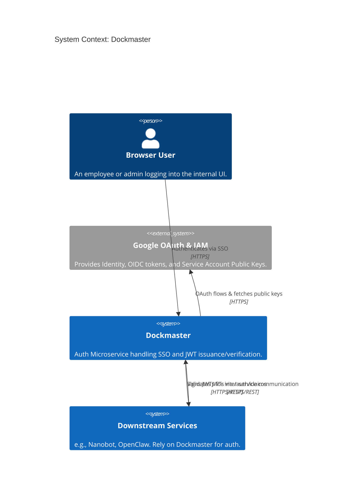
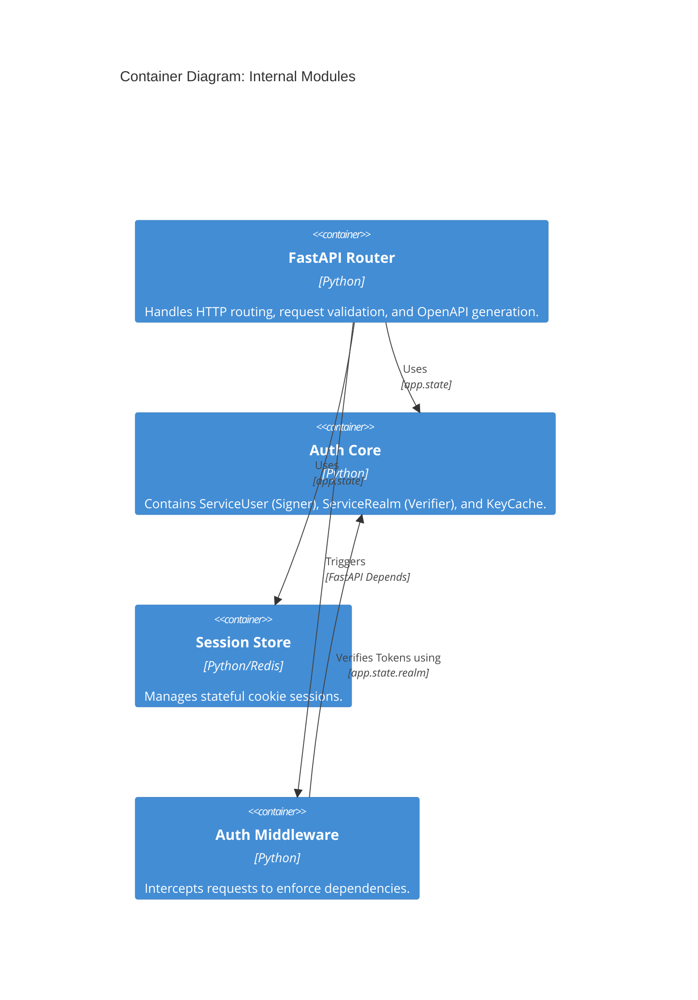
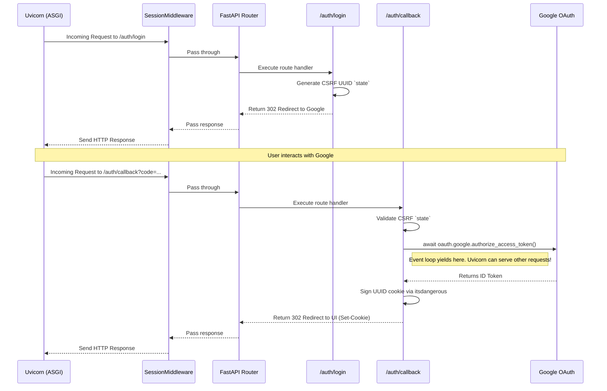
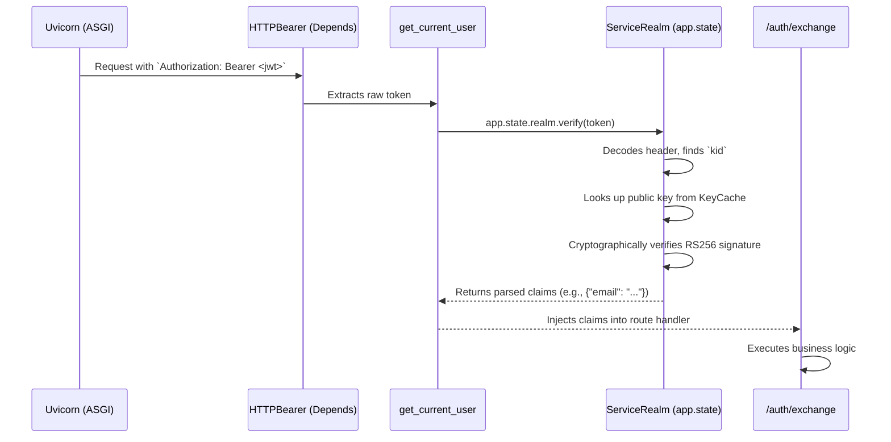

# Dockmaster: Comprehensive Architecture & Framework Overview

Welcome to the deep dive into Dockmaster's architecture. This guide is built for experienced developers. It won't just tell you *what* the code does; it focuses heavily on the *logic* and *reasoning* behind the architectural choices, framework mechanics, and state management strategies.

## Table of Contents
1. [Architectural Philosophy](#1-architectural-philosophy)
2. [High-Level System Context (C4 Model)](#2-high-level-system-context-c4-model)
3. [Framework Mechanics: FastAPI & ASGI](#3-framework-mechanics-fastapi--asgi)
4. [Execution Traces: The Request Lifecycle](#4-execution-traces-the-request-lifecycle)
5. [State Management & Concurrency](#5-state-management--concurrency)
6. [Testing Case Study: Mocking State](#6-testing-case-study-mocking-state)

---

## 1. Architectural Philosophy

Dockmaster exists to solve a specific problem: unifying two fundamentally different authentication paradigms into a single, cohesive microservice boundary.

### The Two Paradigms: Stateful vs. Stateless
1. **Browser SSO (Stateful):** Web browsers need to handle user sessions securely. They use OAuth to log in via Google, but post-login, they rely on **Session Cookies**. This is stateful. The server must remember that `Session ID X` belongs to `User Y`.
2. **Service-to-Service (Stateless):** Microservices (like Nanobot or OpenClaw) don't have sessions. They communicate via APIs and authenticate using **JSON Web Tokens (JWTs)** in the `Authorization: Bearer <token>` header. This is stateless. The token itself contains all the claims (like the `kid` to find the public key, and the `exp` for expiration).

### The Microservice Boundary
Dockmaster sits at the perimeter of the infrastructure.
- **For UIs**, it issues cryptographically signed session cookies (`itsdangerous`) backed by an in-memory or Redis session store.
- **For Microservices**, it signs JWTs using a Google Service Account private key (`ServiceUser`) and verifies incoming JWTs using cached public keys (`ServiceRealm`).

By centralizing both paradigms here, downstream services can trust the headers they receive and focus purely on business logic.

---

## 2. High-Level System Context (C4 Model)

Here is how Dockmaster fits into the broader cloud ecosystem.

### System Context Diagram



### Container Diagram (Internal Boundaries)



---

## 3. Framework Mechanics: FastAPI & ASGI

Dockmaster uses **FastAPI**, which is built on top of **Starlette** (for ASGI routing) and **Pydantic** (for data validation).

### ASGI vs. WSGI
Traditional Python web frameworks like Flask and Django use **WSGI** (Web Server Gateway Interface). WSGI is inherently **synchronous**. If a request needs to make an HTTP call to Google to fetch public keys, the entire thread blocks, waiting for the I/O.

FastAPI uses **ASGI** (Asynchronous Server Gateway Interface). 
- **The Logic:** Under the hood, an event loop (via `asyncio` and `uvicorn`) manages requests. When Dockmaster awaits an OAuth token exchange (`await oauth.google.authorize_access_token(...)`), the event loop pauses that specific request and switches to serving other incoming requests. 
- **The Result:** Massive concurrency gains for I/O-bound tasks without the overhead of spinning up thousands of OS threads.

### Dependency Injection (The "Why" of FastAPI)
FastAPI's superpower is its `Depends()` system. It allows you to declare exactly what a route needs to function.

```python
# src/dockmaster/routes/login.py
@router.get("/login")
async def login(request: Request, settings: Settings = Depends(get_settings)):
    pass
```
If `get_settings` fails, the route is never executed. This pushes validation to the edges of the application.

---

## 4. Execution Traces: The Request Lifecycle

To truly understand the framework, let's trace two distinct requests linearly from the server (`uvicorn`) down to the endpoint.

### Trace 1: Browser SSO (`/auth/login` to `/auth/callback`)
This traces the complex interaction of external state, SessionMiddleware, and Async execution.



### Trace 2: Service-to-Service JWT Validation (`/auth/exchange`)
This traces how internal dependency injection and `app.state` singletons protect endpoints.



**The Logic:** Notice that in Trace 2, the endpoint *never* sees an invalid token. If `verify(token)` raises a `ValueError`, `get_current_user` catches it and raises an `HTTPException(401)`. Execution stops before the route handler is ever invoked.

---

## 5. State Management & Concurrency

In a web application, global state is dangerous. If you use global variables (e.g., `realm = ServiceRealm(...)` at the top of a module), you risk race conditions or bleeding state between tests.

### The `app.state` Pattern
FastAPI provides the `request.app.state` object. It is initialized *once* during the application's lifespan.

```python
# src/dockmaster/main.py
@asynccontextmanager
async def lifespan(app: FastAPI):
    # Initialize singletons
    app.state.session_store = InMemorySessionStore()
    app.state.realm = ServiceRealm(key_cache=ServiceAccountKeyCache(...))
    yield
```

### Concurrency Implications
Because `uvicorn` uses an async event loop, **there is only one thread running at a time**. 
- **Thread Safety:** You do not need complex threading locks (`threading.Lock`) to read from `app.state.realm`. 
- **I/O Blocking:** However, you **must not** perform synchronous blocking I/O (like a `requests.get` call) inside the event loop, or you will freeze the entire server. This is why tools like `httpx` or `authlib`'s async clients are used when fetching public keys dynamically.

---

## 6. Testing Case Study: Mocking State

The most powerful reason we use `app.state` and Dependency Injection is **testability**. We employ a "Tracer Bullet + TDD" approach.

Let's look at a concrete case study from `tests/conftest.py` and `tests/test_middleware.py`.

### The Problem: Testing JWT Verification
To test `get_current_user`, we need a JWT and a `ServiceRealm` to verify it. But `ServiceRealm` normally connects to Google to fetch public keys. We do not want our unit tests making network calls.

### The Solution: Overriding `app.state` via Fixtures
Instead of mocking the `requests` library (which is brittle), we use Pytest fixtures to inject a fake `ServiceRealm` directly into the application state.

**Step 1: Create a Fake Realm in `conftest.py`**
```python
@pytest.fixture
def fake_realm(fake_sa_key_data, rsa_public_key_pem) -> ServiceRealm:
    """ServiceRealm backed by a local RSA key pair generated for the test session."""
    kid = fake_sa_key_data["private_key_id"]

    # We mock the KeyCache interface, not the network call!
    class FixedKeyCache(KeyCache):
        def update(self) -> None:
            self._keys = {kid: rsa_public_key_pem}

    return ServiceRealm(key_cache=FixedKeyCache())
```

**Step 2: Wire it into a TestClient**
```python
@pytest.fixture
def auth_client(app: FastAPI, fake_realm: ServiceRealm) -> TestClient:
    """TestClient with app.state.realm wired to the fake realm."""
    with TestClient(app) as client:
        # Override the state before yielding the client
        app.state.realm = fake_realm
        yield client
```

**Step 3: Write the Clean Test**
```python
# tests/test_middleware.py
class TestGetCurrentUser:
    def test_valid_token_returns_claims(self, auth_client, valid_token):
        # valid_token is signed by the matching private key fixture
        response = auth_client.get("/auth/claims", headers={"Authorization": f"Bearer {valid_token}"})
        
        assert response.status_code == 200
        assert response.json()["email"] == "test@example.com"
```

**The Logic & Reasoning:**
By abstracting the state to `app.state.realm` and relying on the `KeyCacheLike` protocol, we created a system that is entirely immune to network flakiness during tests. The test logic is perfectly self-consistent: a key pair is generated, the private key signs the token, the public key is injected into the fake cache, and the middleware verifies it flawlessly. 

This is the power of a decoupled, protocol-driven architecture.