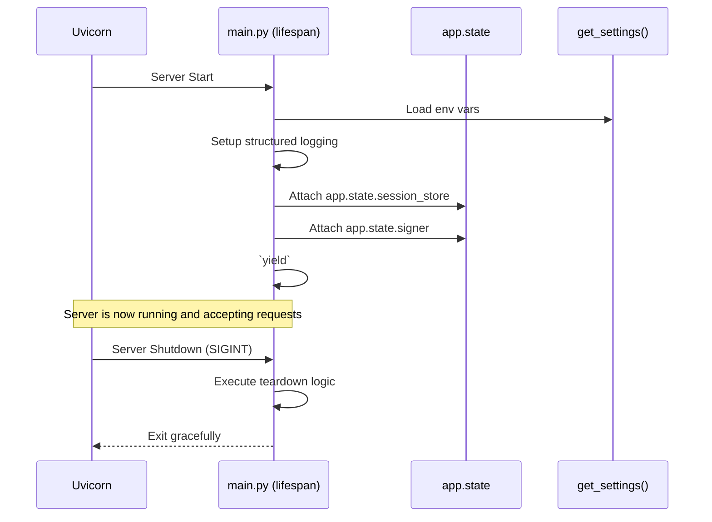
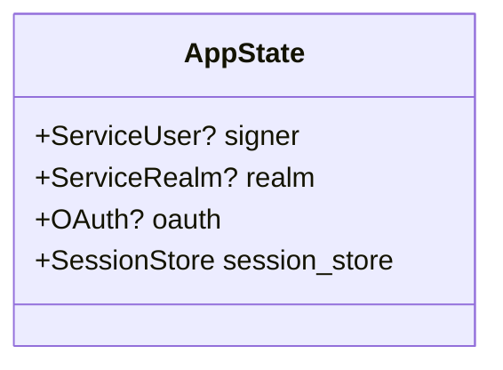

# Configuration and Startup Lifecycles

In modern 12-factor apps, configuration must be strictly separated from code and loaded via the environment. Dockmaster handles this securely and robustly using **Pydantic Settings** and **FastAPI Lifespan events**. 

This guide dives into the Pythonic mechanics of how Dockmaster parses the environment, safely manages secrets, boots up its async resources, and prepares for incoming requests.

---

## 1. Pydantic Deep Dive (`config.py`)

Dockmaster relies on `pydantic-settings` to centralize configuration. Instead of sprinkling `os.environ.get("...")` throughout the codebase, environment variables are loaded, validated, and coerced into a strict `Settings` object before the application even starts.

### The Loading Precedence
`pydantic-settings` evaluates configurations in a specific order of precedence:
1. Environment variables (highest priority, e.g., `export CLIENT_ID="abc"`).
2. The `.env` file (if present, excellent for local development).
3. The default values defined in the class itself.

### Case Study: The Comma-Separated Parser
In a 12-factor app, environment variables are strictly strings. But Dockmaster needs complex data structures, like a `set` of authorized domains, for fast O(1) membership lookups.

To bridge this gap, Dockmaster uses a custom parser combined with Pydantic's `@model_validator`.

```python
# src/dockmaster/config.py
def _parse_comma_separated(v: Any) -> set[str]:
    """Parse a comma-separated string into a set of stripped strings."""
    if v is None or v == "":
        return set()
    # If it's already a set or list (e.g. from tests passing real lists)
    if isinstance(v, (set, frozenset)):
        return set(v)
    if isinstance(v, list):
        return set(v)
    # The actual string parsing logic
    if isinstance(v, str):
        return {s.strip() for s in v.split(",") if s.strip()}
    return set()

class Settings(BaseSettings):
    # Typed as str for env var loading, but converted to set in postprocess
    authorized_domains: str | set[str] = ""

    @model_validator(mode="after")
    def postprocess(self) -> "Settings":
        self.authorized_domains = _parse_comma_separated(self.authorized_domains)
        return self
```

**The Logic (Line-by-Line):**
1. We define `authorized_domains` as `str | set[str]`. This tells Pydantic: "Accept a string from the environment, but expect it to become a set."
2. The `@model_validator(mode="after")` hook runs *after* Pydantic binds the environment variables to the model fields.
3. The `_parse_comma_separated` function handles the type coercion safely. It splits the string by commas, strips surrounding whitespace, and drops empty strings, yielding a pristine `set[str]`.

### Security: `SecretStr`
For sensitive fields like `client_secret`, we use Pydantic's `SecretStr`.

```python
class Settings(BaseSettings):
    client_secret: SecretStr | None = None
```
**Why?** `SecretStr` prevents accidental logging. If you print the settings object (`print(settings)`), it outputs `client_secret='**********'`. To actually use the value (e.g., when initializing the OAuth client), you must explicitly call `.get_secret_value()`.

---

## 2. Testing Configuration

How do we test configuration loading without messing up our actual environment? We use two distinct strategies: **Monkeypatching** and **Dependency Overrides**.

### Strategy 1: Monkeypatching (Testing the Config Class)
When testing `config.py` itself, we want to simulate the OS environment. Pytest's `monkeypatch` fixture allows us to temporarily inject environment variables.

```python
# tests/test_config.py
def test_comma_separated_from_env(monkeypatch):
    # Inject a fake env var
    monkeypatch.setenv("AUTHORIZED_ISSUERS", "x,y,z")
    
    # Instantiate Settings (reads from monkeypatched env)
    settings = Settings()
    
    assert settings.authorized_issuers == {"x", "y", "z"}
```

### Strategy 2: Dependency Overrides (Testing Routes)
When testing *routes* (like `/auth/login`), we don't want to parse `.env` files or touch the OS at all. We want to inject a perfectly mocked `Settings` object directly into FastAPI.

To do this, we rely on FastAPI's `dependency_overrides`. But first, we must understand the caching mechanism.

#### The LRU Cache
In `config.py`, we instantiate settings via a cached function:
```python
@lru_cache
def get_settings() -> Settings:
    return Settings()
```
**Performance Logic:** Parsing strings and files is slow. `@lru_cache` ensures `Settings()` is instantiated exactly once. Every route using `Depends(get_settings)` gets the exact same cached object in memory.

#### Overriding the Cache in Tests
In `conftest.py`, we bypass this cache completely for tests:

```mermaid
graph TD
    Test[Pytest Client] -->|HTTP Request| Router[FastAPI Router]
    Router -->|Depends(get_settings)| Override[app.dependency_overrides]
    Override -->|Returns| MockSettings[Mock Test Settings]
    MockSettings -->|Injected into| RouteLogic[Route Handler Logic]
    
    style Override stroke:#f66,stroke-width:2px
```

```python
# tests/conftest.py
@pytest.fixture
def app(test_settings: Settings) -> FastAPI:
    application = create_app()
    # Override the dependency globally for this test app instance
    application.dependency_overrides[get_settings] = lambda: test_settings
    return application
```
This is the cleanest, most deterministic way to test an ASGI application.

---

## 3. The FastAPI Lifespan Sequence

Once configuration is loaded, the application must boot up its stateful resources (like the Session Store and the Auth Singletons). FastAPI uses an `asynccontextmanager` called `lifespan`.

### The Sequence Diagram



### The State Class Diagram
By the time the `yield` statement is hit, the application state looks like this:



### Case Study: Graceful Degradation
What happens if the application is deployed without a `CLIENT_ID` or an `ISSUER` (GCP service account)? 

Instead of crashing entirely (which would break health checks and bring down the container), the lifespan event initializes those specific states as `None` and emits structured warnings.

```python
# src/dockmaster/main.py
if settings.client_id:
    app.state.oauth = create_oauth(settings)
    log.info("oauth client initialized")
else:
    app.state.oauth = None
    log.warning("CLIENT_ID not set — OAuth login will return 503")
```

**Route-Level Handling:**
Because the state degrades gracefully, the downstream routes must be aware of this. Look at how `/auth/login` handles a missing OAuth client:

```python
# src/dockmaster/routes/login.py
@router.get("/login")
async def login(request: Request):
    oauth = getattr(request.app.state, "oauth", None)
    if oauth is None:
        raise HTTPException(status_code=503, detail="OAuth not configured")
```

This pattern ensures that a partial misconfiguration only degrades the *specific feature* that relies on it (e.g., SSO goes down, but JWT verification might still work fine). The structured logging (`log.warning`) ensures DevOps teams are immediately notified during boot.
