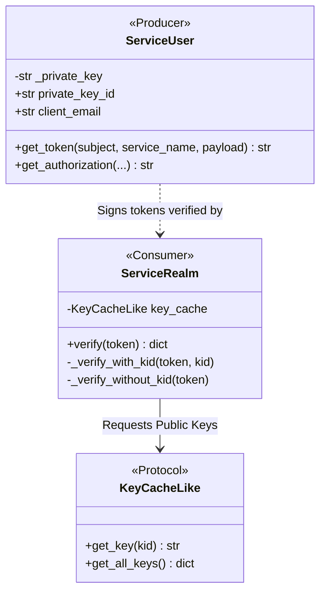
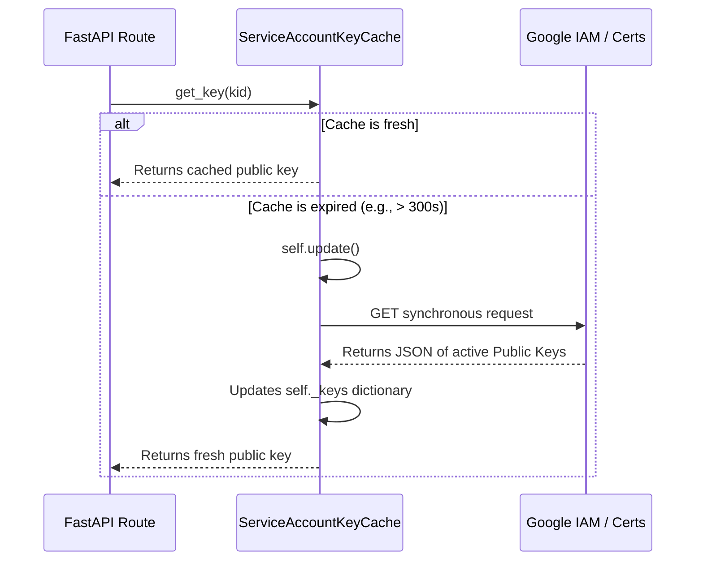

# Service-to-Service Auth (JWT)

While browsers use stateful sessions (Cookies + Session Store), internal microservices communicate statelessly. In the Dockmaster architecture, a downstream service (like an API gateway or another backend worker) needs to prove its identity to Dockmaster or other services without relying on browser redirects.

We solve this using **JSON Web Tokens (JWTs)**.

This guide explores the Symmetric Cryptographic Architecture of Dockmaster, placing the Signer and Verifier side-by-side, diving into the security mitigations, dependency injection patterns, and providing practical examples.

---

## 1. The Symmetric Cryptographic Architecture

At the heart of the system are two classes that mirror each other: the `ServiceUser` (Producer) and the `ServiceRealm` (Consumer). 
They communicate via an asymmetric key pair (RSA-256).

### Class Diagram: The Core Interface



### Side-by-Side: Producer vs Consumer

#### The Producer: `ServiceUser`
The `ServiceUser` is instantiated at boot with a **GCP Service Account JSON file**. 
During `__init__`, it parses this file exactly once, storing the `_private_key` string. Cryptographic parsing is CPU intensive, so doing it once at startup allows `get_token()` to be extremely fast.

**The Semantic Claims:**
When signing a token, Dockmaster injects specific claims:
- `iss`: Issuer. The service account email.
- `sub`: Subject. The identity of the caller.
- `aud`: Audience. Who this token is meant for.
- `iat` / `exp`: Issued At and Expiration. Time-bounds the token to prevent replay attacks.

#### The Consumer: `ServiceRealm`
The `ServiceRealm` receives a raw string token. It needs the **Public Key** to verify the signature. 
Instead of tightly coupling `ServiceRealm` to a network class that fetches keys from Google, we use a Python `Protocol` (`KeyCacheLike`).

**OOP vs Dependency Injection (DI):**
By using structural subtyping (`Protocol`), `ServiceRealm` simply says: *"I don't care how you get the keys—from a database, from Google, or from a test fixture. Just give me an object with `get_key(kid)` and `get_all_keys()`."*
This is what allows us to inject a fake, local RSA key pair during testing without mocking `requests`.

---

## 2. JWT Vulnerabilities & Mitigations

When dealing with PyJWT, there are several known attack vectors that Dockmaster explicitly mitigates.

### 1. The "Algorithm Downgrade" Attack (`alg: none`)
A classic attack is to modify the token header to `{"alg": "none"}`, remove the signature, and send it to the server. If the server trusts the header blindly, it will accept the unsigned token.

**The Mitigation:** In `jwt.decode`, Dockmaster hardcodes the expected algorithm.
```python
jwt.decode(token, key, algorithms=["RS256"], options={"verify_aud": False})
```
By forcing `algorithms=["RS256"]`, PyJWT will immediately reject any token that tries to downgrade the algorithm to `HS256` or `none`.

### 2. Audience Deferral
Notice `options={"verify_aud": False}`. Why disable audience checking? 
Because `ServiceRealm` is a generic cryptographic verifier. The *business logic* of whether a token is meant for a specific endpoint shouldn't happen at the cryptographic layer. We verify the math here, and we leave the authorization (the "who") to the FastAPI route handler.

### 3. The Fallback Logic (Missing `kid`)
Modern Google tokens include a `kid` (Key ID) in the header. `ServiceRealm` extracts the `kid`, asks the cache for the specific key, and verifies it. O(1) complexity.

However, some legacy or internal tokens omit the `kid`. 
**The Resilience Pattern:** Instead of failing, `_verify_without_kid(token)` asks the cache for *all* keys and runs a `for` loop, trying each public key against the signature until one succeeds or they all fail. It trades slight CPU time for massive system resilience.

---

## 3. The `KeyCache` Lifecycle

How does the real cache get public keys from Google without blocking the async event loop?


*Note: In highly concurrent environments, `self.update()` should ideally use a thread lock to prevent a "thundering herd" of 50 requests all trying to fetch keys at the exact same millisecond.*

---

## 4. FastAPI Middleware & OpenAPI

We connect `ServiceRealm` to our HTTP endpoints using FastAPI's dependency injection.

```python
# src/dockmaster/auth/middleware.py
from fastapi.security import HTTPBearer

_bearer = HTTPBearer(auto_error=False)

async def get_current_user(
    request: Request,
    credentials: HTTPAuthorizationCredentials | None = Depends(_bearer),
) -> dict:
    if credentials is None:
        raise HTTPException(status_code=401, detail="Not authenticated")

    realm = getattr(request.app.state, "realm", None)
    
    try:
        return realm.verify(credentials.credentials)
    except ValueError as exc:
        raise HTTPException(status_code=401, detail=str(exc))
```

### The OpenAPI Magic
By using `HTTPBearer()`, FastAPI automatically parses our code and generates the OpenAPI schema. When you load the Swagger UI (`/docs`), a little "Authorize" lock icon appears, allowing you to paste a JWT in the browser to test endpoints.

### Manual Error Handling (`auto_error=False`)
By default, `HTTPBearer` throws an automatic 403 error if the header is missing. We pass `auto_error=False` so we can handle it manually. 

**Why?** This allows us to cleanly map `ValueError` (thrown by our custom `ServiceRealm`) into standard `HTTPException(401)` errors. The route handler (e.g., `def my_endpoint(user: dict = Depends(get_current_user)):`) remains completely pure. It never sees HTTP headers, and it never executes if the token is invalid. Error handling is completely isolated.

### Bridging Starlette State
Notice `request.app.state.realm`. `Depends` functions don't automatically get the `app` object. We must request the raw Starlette `Request` object to bridge the gap between FastAPI's dependency injection and the Starlette application state created during the lifespan event.

---

## 5. Practical Usage Examples

Here are concrete examples of how to interact with this system as a developer.

### Example 1: Downstream Service Calling Dockmaster
If you are writing a Python service (like `Nanobot`) that needs to fetch data from Dockmaster:

```python
import requests
from dockmaster.auth.jwt_signer import ServiceUser

# 1. Initialize your local signer with your service account
signer = ServiceUser("path/to/nanobot-sa.json")

# 2. Generate a bearer token meant for Dockmaster
auth_header = signer.get_authorization(
    subject="nanobot@project.iam.gserviceaccount.com",
    service_name="dockmaster"
)

# 3. Make the API Call
response = requests.get(
    "https://dockmaster.internal/auth/claims",
    headers={"Authorization": auth_header}
)

print(response.json())
```

### Example 2: Debugging a JWT in the Python Shell
If a token is failing verification and you want to inspect its claims without verifying the cryptographic signature:

```bash
$ uv run python
```

```python
import jwt

raw_token = "eyJhbGciOiJSUzI1NiIsImtpZ..."

# Decode the unverified header to see the 'kid' and 'alg'
header = jwt.get_unverified_header(raw_token)
print(f"Header: {header}")

# Decode the unverified payload to see claims (exp, iss, aud)
claims = jwt.decode(raw_token, options={"verify_signature": False})
print(f"Claims: {claims}")
```
*(Never use `verify_signature: False` in production application logic. It is strictly for local debugging!)*